<div align="center">

<br>

# Telco Customer Churn — MLOps Pipeline

### *End-to-End Machine Learning Operations on Your Local Machine*

<br>

[](https://python.org)
[](https://fastapi.tiangolo.com)
[](https://mlflow.org)
[](https://docker.com)
[](https://prometheus.io)
[](https://grafana.com)
[](https://feast.dev)
[](https://github.com/features/actions)

<br>

A production-grade, fully local MLOps platform that **trains**, **serves**, **monitors**, and **retrains** a telecom customer churn prediction model — all running on your machine with Docker Compose.

<br>

[Getting Started](#-getting-started) · [Architecture](#-architecture) · [API Reference](#-api-reference) · [Screenshots](#-screenshots)

<br>

---

</div>

<br>

## 📋 Table of Contents

<details>
<summary><b>Click to expand</b></summary>

<br>

- [Overview](#-overview)
- [Architecture](#-architecture)
- [Tech Stack](#-tech-stack)
- [Project Structure](#-project-structure)
- [Infrastructure Services](#-infrastructure-services)
- [Pipeline Phases](#-pipeline-phases)
- [API Reference](#-api-reference)
- [Monitoring & Observability](#-monitoring--observability)
- [Data Drift Detection](#-data-drift-detection)
- [Screenshots](#-screenshots)
- [Getting Started](#-getting-started)
- [Makefile Commands](#-makefile-commands)
- [CI/CD Pipeline](#-cicd-pipeline)
- [Configuration](#-configuration)
- [Model Details](#-model-details)

</details>

<br>

## 🔭 Overview

> **What is this?** — A complete, locally reproducible MLOps lifecycle for predicting customer churn in a telecommunications company. Every stage — from data versioning to model retraining — runs on your machine.

<br>

<table>
<tr>
<td width="50%" valign="top">

### ✨ Key Capabilities

| | Capability | Tool |
|:--|:---|:---|
| 🗂️ | Data Versioning | DVC + MinIO |
| 🏪 | Feature Store | Feast |
| 🧪 | Experiment Tracking | MLflow |
| 🚀 | Model Serving | FastAPI |
| 📊 | Monitoring | Prometheus + Grafana |
| 🔍 | Drift Detection | Evidently AI + KS-Test |
| 🔄 | Auto Retraining | Prefect |
| ✅ | CI Pipeline | GitHub Actions |

</td>
<td width="50%" valign="top">

### 🏛️ Design Principles

- **🔒 Fully Local** — No cloud accounts or API keys needed
- **🐳 Docker-First** — One command to launch 6 services
- **📦 Reproducible** — Deterministic deps with `uv.lock`
- **🧩 Modular** — Each phase is independently runnable
- **📈 Observable** — Every prediction is logged and tracked
- **🛡️ Resource-Safe** — CPU/memory limits prevent host crashes

</td>
</tr>
</table>

<br>

<p align="right"><a href="#-table-of-contents">↑ back to top</a></p>

---

<br>

## 🏗 Architecture

### System Architecture

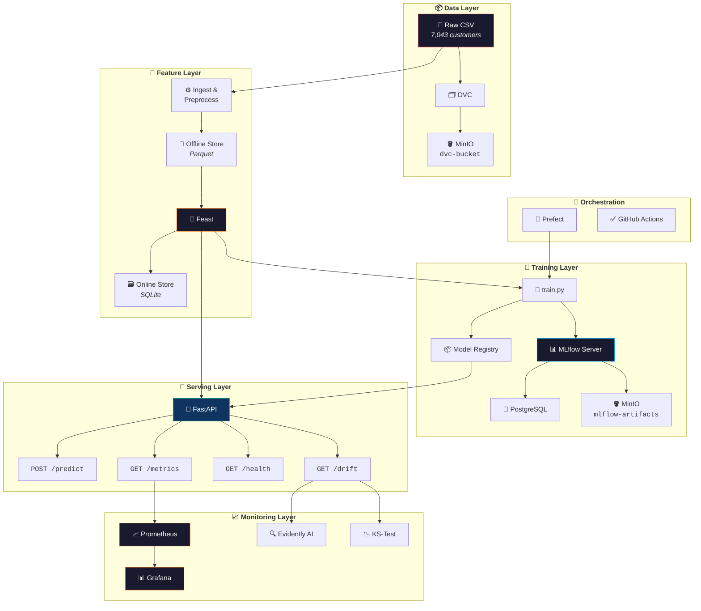

<br>

### Request Flow

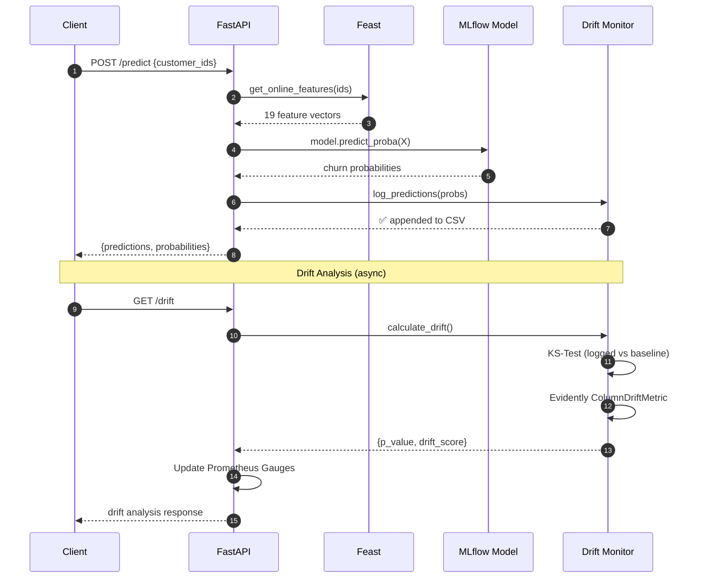

<br>

<p align="right"><a href="#-table-of-contents">↑ back to top</a></p>

---

<br>

## 🛠 Tech Stack

<details open>
<summary><b>Core ML & Data</b></summary>

<br>

| Technology | Version | Purpose |
|:---|:---:|:---|
|  | `3.12` | Runtime environment |
|  | `≥1.4` | Random Forest classifier pipeline |
|  | `≥2.2` | Data manipulation & feature engineering |
|  | `≥1.26` | Numerical computation |
|  | `≥15.0` | High-performance Parquet I/O |

</details>

<details open>
<summary><b>MLOps & Infrastructure</b></summary>

<br>

| Technology | Version | Purpose |
|:---|:---:|:---|
|  | `≥2.11` | Experiment tracking & model registry |
|  | `≥0.37` | Feature store (offline Parquet + online SQLite) |
|  | `≥3.52` | Data version control with MinIO remote |
|  | `≥2.16` | Workflow orchestration for retraining |
|  | `≥0.4` | Statistical data drift detection |

</details>

<details open>
<summary><b>Serving & Monitoring</b></summary>

<br>

| Technology | Version | Purpose |
|:---|:---:|:---|
|  | `≥0.110` | Async REST API for inference |
|  | `latest` | Metrics collection (15s scrape) |
|  | `latest` | Dashboards & visualization |
|  | `3.8` | Multi-container orchestration |

</details>

<details open>
<summary><b>DevOps & Quality</b></summary>

<br>

| Technology | Version | Purpose |
|:---|:---:|:---|
|  | `—` | CI pipeline (lint → test → build) |
|  | `≥0.3` | Ultra-fast linter & formatter |
|  | `≥8.0` | Unit & integration testing |
|  | `latest` | Ultra-fast package manager |
|  | `latest` | S3-compatible object storage |
|  | `15` | MLflow metadata backend |

</details>

<br>

<p align="right"><a href="#-table-of-contents">↑ back to top</a></p>

---

<br>

## 📁 Project Structure

```
telco-churn-mlops/
│
├── 📂 .github/workflows/
│   └── ci.yml                          # 🔄 GitHub Actions CI pipeline
│
├── 📂 app/                             # 🚀 FastAPI inference service
│   ├── main.py                         #    ├─ Server: /predict, /drift, /health, /metrics
│   ├── schema.py                       #    ├─ Pydantic request/response models
│   └── drift_monitor.py                #    └─ KS-test + Evidently AI drift engine
│
├── 📂 assets/                          # 🖼️ Project screenshots
│   ├── docker-containers.png           #    ├─ Docker Desktop services view
│   ├── minio-dvc-bucket.png            #    ├─ MinIO object browser
│   ├── mlflow-training-runs.png        #    ├─ MLflow experiment runs
│   ├── mlflow-run-metrics.png          #    ├─ MLflow run detail
│   ├── fastapi-swagger-docs.png        #    ├─ FastAPI Swagger UI
│   ├── prometheus-targets.png          #    ├─ Prometheus target health
│   └── grafana-metrics.png             #    └─ Grafana dashboard
│
├── 📂 data/                            # 💾 DVC-tracked data
│   ├── Telco-Customer-Churn.csv        #    ├─ Raw dataset (7,043 rows)
│   ├── churn_features.parquet          #    ├─ Feast offline store
│   ├── online_store.db                 #    ├─ Feast online store (SQLite)
│   ├── baseline_probabilities.npy      #    ├─ Baseline distribution
│   └── prediction_logs.csv             #    └─ Live prediction audit trail
│
├── 📂 feature_store/                   # 🏪 Feast configuration
│   ├── feature_store.yaml              #    ├─ Provider config
│   └── features.py                     #    └─ Entity + feature view definitions
│
├── 📂 prometheus/
│   └── prometheus.yml                  # 📈 Scraper config → api:8000/metrics
│
├── 📂 src/                             # ⚙️ Pipeline modules
│   ├── data/
│   │   └── ingest_and_prepare_features.py  #  ETL: raw CSV → clean Parquet
│   ├── models/
│   │   └── train.py                        #  Training + MLflow logging
│   └── workflows/
│       └── retrain_flow.py                 #  Prefect retraining flow
│
├── 📂 tests/                           # 🧪 Test suite
│   ├── test_api.py                     #    ├─ API endpoint tests (mocked)
│   └── test_features.py               #    └─ Feature engineering tests
│
├── .gitignore                          # Git exclusions
├── docker-compose.yml                  # 🐳 6-service orchestration
├── Dockerfile                          # Container image definition
├── Makefile                            # Developer shortcuts
├── pyproject.toml                      # PEP 621 project config
└── uv.lock                            # Deterministic dependency lock
```

<br>

<p align="right"><a href="#-table-of-contents">↑ back to top</a></p>

---

<br>

## 🐳 Infrastructure Services

> All services launch with a single command: `docker compose up -d`

<br>

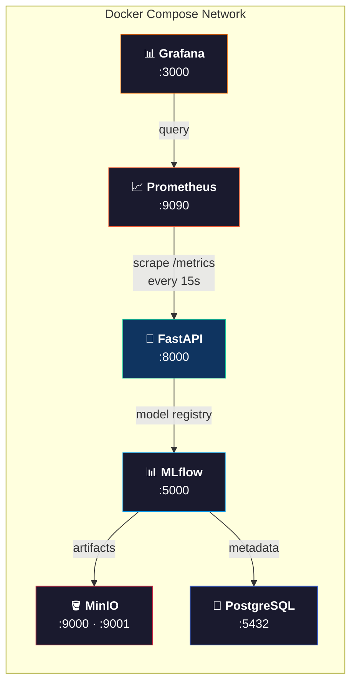

<br>

<table>
<tr>
<th>Service</th>
<th>Image</th>
<th>Ports</th>
<th>Limits</th>
<th>Role</th>
</tr>
<tr>
<td><b>🪣 MinIO</b></td>
<td><code>minio/minio:latest</code></td>
<td><code>9000</code> · <code>9001</code></td>
<td>—</td>
<td>S3-compatible storage for DVC data & MLflow artifacts</td>
</tr>
<tr>
<td><b>🐘 PostgreSQL</b></td>
<td><code>postgres:15-alpine</code></td>
<td><code>5432</code></td>
<td>—</td>
<td>MLflow backend metadata store</td>
</tr>
<tr>
<td><b>📊 MLflow</b></td>
<td><code>ghcr.io/mlflow/mlflow</code></td>
<td><code>5000</code></td>
<td>—</td>
<td>Experiment tracking & model registry</td>
</tr>
<tr>
<td><b>🚀 FastAPI</b></td>
<td><code>mlops-api</code> <i>(custom)</i></td>
<td><code>8000</code></td>
<td>—</td>
<td>REST inference server with Feast & drift detection</td>
</tr>
<tr>
<td><b>📈 Prometheus</b></td>
<td><code>prom/prometheus:latest</code></td>
<td><code>9090</code></td>
<td>🔒 0.50 CPU / 512MB</td>
<td>Metrics scraping every 15s</td>
</tr>
<tr>
<td><b>📊 Grafana</b></td>
<td><code>grafana/grafana:latest</code></td>
<td><code>3000</code></td>
<td>🔒 0.50 CPU / 512MB</td>
<td>Monitoring dashboards & alerting</td>
</tr>
</table>

> [!WARNING]
> **Resource Limits** — Prometheus and Grafana are capped at **0.50 CPU** and **512MB RAM** each to prevent memory pressure on the host during heavy retraining cycles.

<br>

<p align="right"><a href="#-table-of-contents">↑ back to top</a></p>

---

<br>

## 🔄 Pipeline Phases

This project was built in **5 incremental phases**, each adding a new MLOps capability layer:

<br>

<table>
<tr>
<td width="60" align="center"><h2>1</h2></td>
<td>

### 🗂️ Environment & Data Versioning

> *Foundation: Python isolation, Git config, DVC + MinIO remote*

- Initialized project with **uv** (PEP 621 `pyproject.toml` + deterministic `uv.lock`)
- Configured `.gitignore` to exclude `.dvc/cache`, `.venv`, `__pycache__`
- Deployed **MinIO** (S3-compatible) and **PostgreSQL** via Docker Compose
- Initialized **DVC** with remote pointing to `s3://dvc-bucket` on local MinIO

</td>
</tr>
</table>

<table>
<tr>
<td width="60" align="center"><h2>2</h2></td>
<td>

### 🏪 Feature Store & Experiment Tracking

> *Feast for features, MLflow for experiments*

- **Feast Feature Store** — 19 customer attributes served from Parquet offline store and SQLite online store
- **MLflow Tracking Server** — Backed by PostgreSQL (metadata) and MinIO (artifacts)
- Training script retrieves historical features from Feast, trains a classifier pipeline, registers the model in MLflow with full parameter/metric logging

</td>
</tr>
</table>

<table>
<tr>
<td width="60" align="center"><h2>3</h2></td>
<td>

### 🚀 Model Serving & Containerization

> *FastAPI inference with drift detection, Dockerized*

- Built **FastAPI** service loading latest model from MLflow registry on startup with retry logic
- Real-time feature retrieval from **Feast online store** during inference
- Robust CSV prediction logging (header deduplication, append-safe)
- **KS-test** drift detection: min 20 samples, p < 0.05 threshold
- Dockerized as a service inside `docker-compose.yml` with volume mounts

</td>
</tr>
</table>

<table>
<tr>
<td width="60" align="center"><h2>4</h2></td>
<td>

### ✅ Continuous Integration

> *Automated quality gates with GitHub Actions*

- **Ruff** — Ultra-fast linting & formatting enforcement
- **pytest** — Unit tests for feature preprocessing + all API endpoints
- **Docker build** — Container image build verification
- Triggered on every push and pull request to `main`

</td>
</tr>
</table>

<table>
<tr>
<td width="60" align="center"><h2>5</h2></td>
<td>

### 📊 Monitoring & Retraining

> *Prometheus + Grafana observability, Evidently AI drift, Prefect automation*

- **Prometheus** scrapes `/metrics` every 15s for HTTP latency, throughput, and custom drift gauges
- **Grafana** visualizes all metrics from the Prometheus data source
- **Evidently AI** `ColumnDriftMetric` computes statistical drift scores published as Prometheus gauges
- **Prefect** retraining flow pulls DVC data and triggers re-registration in MLflow

</td>
</tr>
</table>

<br>

<p align="right"><a href="#-table-of-contents">↑ back to top</a></p>

---

<br>

## 🔌 API Reference

The FastAPI server exposes **4 endpoints**:

<br>

<details open>
<summary><b><code>POST</code> /predict</b> — Run churn inference</summary>

<br>

Accepts customer IDs → fetches features from Feast → runs inference → logs predictions → returns results.

**Request:**
```json
{
  "customer_ids": ["7590-VHVEG", "5575-GNVDE", "3668-QPYBK"]
}
```

**Response:**
```json
{
  "predictions": [
    { "customer_id": "7590-VHVEG", "churn_probability": 0.5668, "churn_label": "Yes" },
    { "customer_id": "5575-GNVDE", "churn_probability": 0.1181, "churn_label": "No"  },
    { "customer_id": "3668-QPYBK", "churn_probability": 0.3872, "churn_label": "No"  }
  ]
}
```

</details>

<br>

<details open>
<summary><b><code>GET</code> /drift</b> — Analyze prediction drift</summary>

<br>

Performs statistical drift analysis comparing logged predictions against the training baseline.

**✅ Success Response** *(sufficient data):*
```json
{
  "status": "success",
  "p_value": 0.0406,
  "statistic": 0.1044,
  "drift_detected": true,
  "logged_count": 180,
  "baseline_count": 7043,
  "evidently_drift": {
    "p_value": 0.1052,
    "drift_detected": true,
    "drift_score": 0.1052
  }
}
```

**⏳ Insufficient Data Response:**
```json
{
  "status": "insufficient_data",
  "count": 5,
  "message": "Insufficient data: logged predictions count (5) is less than the required minimum (20)."
}
```

</details>

<br>

<details open>
<summary><b><code>GET</code> /health</b> — Service health check</summary>

<br>

```json
{ "status": "healthy", "model_loaded": true, "feast_initialized": true }
```

</details>

<br>

<details open>
<summary><b><code>GET</code> /metrics</b> — Prometheus metrics</summary>

<br>

Exposes standard HTTP metrics + custom Evidently drift gauges in Prometheus text format.

```
# Standard metrics
http_requests_total{handler="/predict",method="POST",status="2xx"} 30.0
http_request_duration_seconds_bucket{handler="/predict",le="0.5"} 28.0

# Custom drift gauges
evidently_prediction_drift_p_value{pid="1"} 0.1052
evidently_prediction_drift_score{pid="1"} 0.1052
evidently_prediction_drift_detected{pid="1"} 1.0
```

</details>

<br>

<p align="right"><a href="#-table-of-contents">↑ back to top</a></p>

---

<br>

## 📊 Monitoring & Observability

### Prometheus Metrics

> Prometheus scrapes the FastAPI `/metrics` endpoint every **15 seconds**.

<br>

| Metric | Type | Description |
|:---|:---:|:---|
| `http_requests_total` | `counter` | Total HTTP requests by method, status, handler |
| `http_request_duration_seconds` | `histogram` | Request latency distribution |
| `http_requests_in_progress` | `gauge` | Currently active requests |
| `evidently_prediction_drift_p_value` | `gauge` | P-value from Evidently AI |
| `evidently_prediction_drift_score` | `gauge` | Drift score from Evidently AI |
| `evidently_prediction_drift_detected` | `gauge` | Binary drift flag (1 = drift) |

<br>

### Grafana Dashboards

Access at **`http://localhost:3000`** &nbsp;→&nbsp; credentials: `admin` / `admin`

| Dashboard Panel | Metric |
|:---|:---|
| 📈 Request Rate | `rate(http_requests_total[5m])` |
| ⏱️ Latency P95 | `histogram_quantile(0.95, http_request_duration_seconds_bucket)` |
| 🔍 Drift P-Value | `evidently_prediction_drift_p_value` |
| 🚦 Drift Alert | `evidently_prediction_drift_detected == 1` |

<br>

<p align="right"><a href="#-table-of-contents">↑ back to top</a></p>

---

<br>

## 📉 Data Drift Detection

The system implements a **dual-approach** drift detection strategy:

<br>

<table>
<tr>
<td width="50%" valign="top">

### 📊 KS-Test (Statistical)

- Compares logged prediction probabilities against training baseline (`baseline_probabilities.npy`)
- **Min threshold**: 20 predictions before analysis
- **Drift flag**: p-value < 0.05
- Returns `insufficient_data` when samples are below minimum

</td>
<td width="50%" valign="top">

### 🔍 Evidently AI (Framework)

- Uses `ColumnDriftMetric` via the legacy API
- Generates structured `Report` comparing current vs. reference distributions
- Publishes results to 3 Prometheus `Gauge` metrics for real-time alerting

</td>
</tr>
</table>

<br>

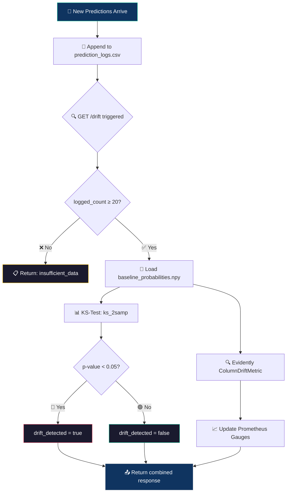

<br>

<p align="right"><a href="#-table-of-contents">↑ back to top</a></p>

---

<br>

## 🖼️ Screenshots

<br>

<details open>
<summary><b>🐳 Docker Infrastructure — All Services Running</b></summary>

<br>

> All 6 containers (MinIO, PostgreSQL, MLflow, FastAPI, Prometheus, Grafana) running with healthy status.

<br>

<div align="center">
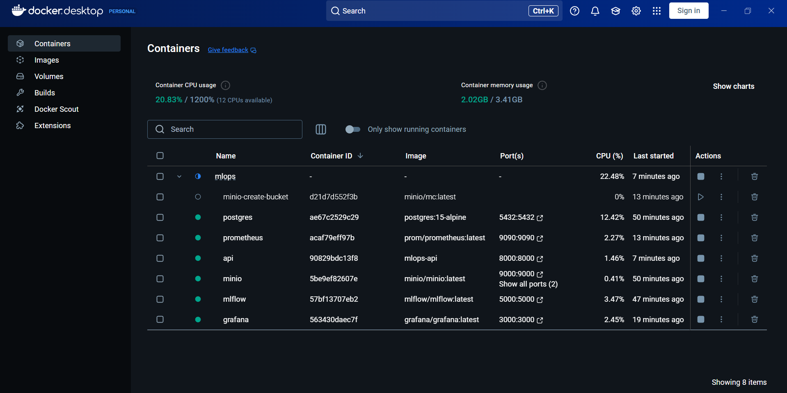
</div>

</details>

<br>

<details open>
<summary><b>🪣 MinIO Object Browser — DVC Bucket</b></summary>

<br>

> DVC-tracked datasets stored in the S3-compatible MinIO bucket `dvc-bucket`.

<br>

<div align="center">
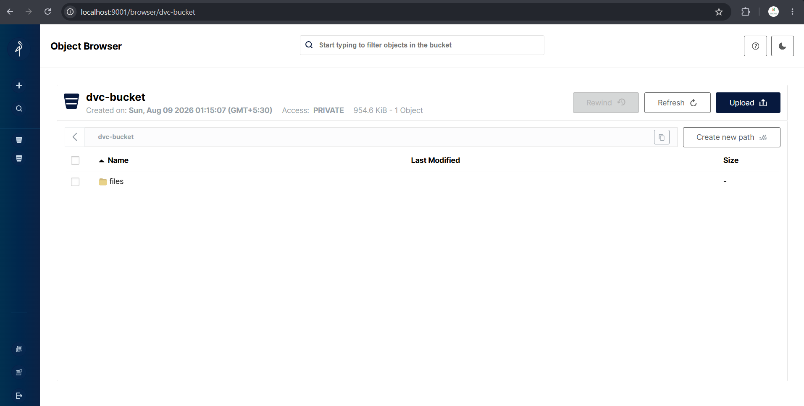
</div>

</details>

<br>

<details open>
<summary><b>📊 MLflow — Training Runs & Model Registry</b></summary>

<br>

> Three training runs tracked in `Telco_Customer_Churn_Training` with versioned models (v1 → v3).

<br>

<div align="center">
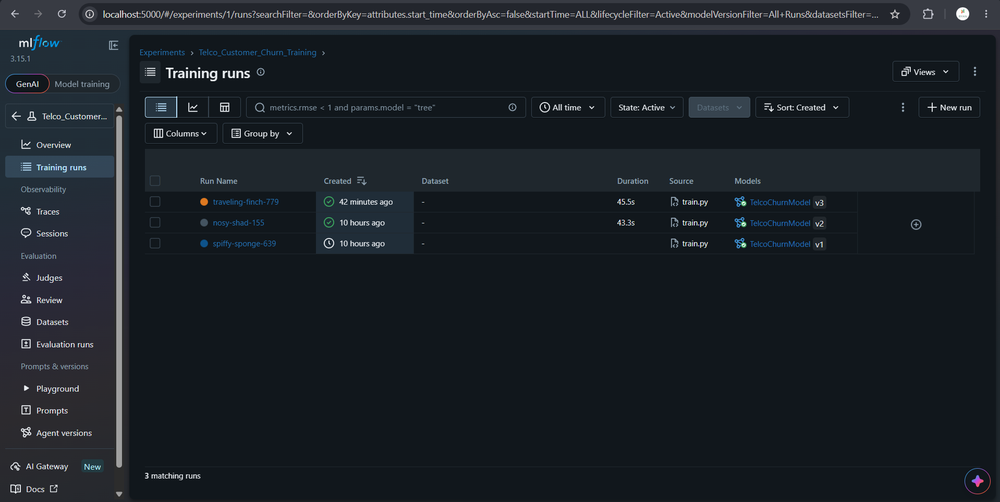
</div>

</details>

<br>

<details open>
<summary><b>📋 MLflow — Run Metrics & Parameters</b></summary>

<br>

> Detailed run view: accuracy (0.796), precision (0.695), recall (0.414), F1 (0.519). Hyperparameters: `n_estimators=100`, `max_depth=6`.

<br>

<div align="center">
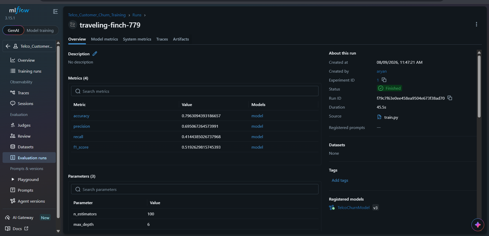
</div>

</details>

<br>

<details open>
<summary><b>🚀 FastAPI — Swagger Documentation</b></summary>

<br>

> Auto-generated OpenAPI docs with all 4 endpoints and Pydantic schemas.

<br>

<div align="center">
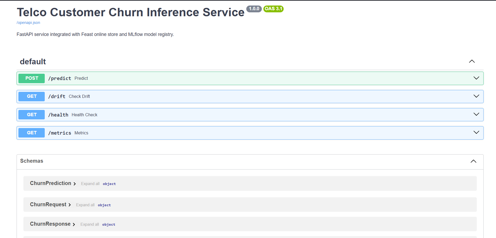
</div>

</details>

<br>

<details open>
<summary><b>📈 Prometheus — Target Health</b></summary>

<br>

> Prometheus scraping `http://api:8000/metrics` — status: **UP**, latency: 18ms.

<br>

<div align="center">
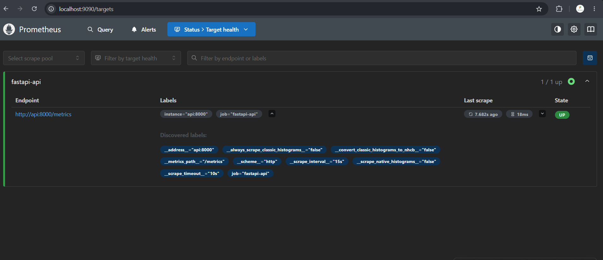
</div>

</details>

<br>

<details open>
<summary><b>📊 Grafana — Metrics Dashboard</b></summary>

<br>

> Real-time Prometheus metrics visualization: scrape rates, series counts, and API uptime.

<br>

<div align="center">
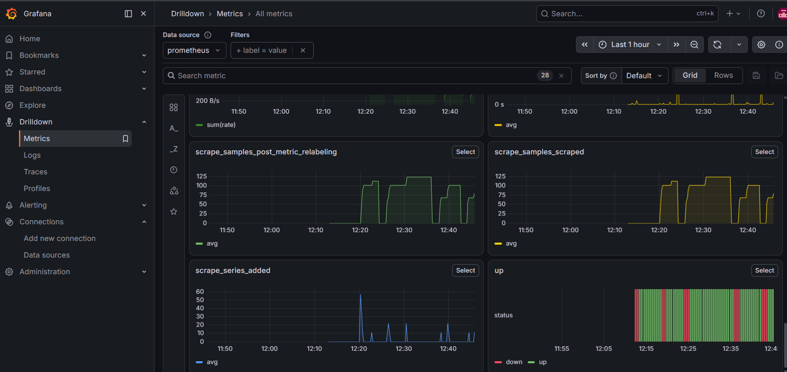
</div>

</details>

<br>

<p align="right"><a href="#-table-of-contents">↑ back to top</a></p>

---

<br>

## 🚀 Getting Started

### Prerequisites

| Requirement | Installation |
|:---|:---|
| **Python ≥ 3.12** | [python.org](https://python.org) |
| **Docker Desktop** | [docker.com](https://docker.com) |
| **uv** | `pip install uv` |
| **Git** | [git-scm.com](https://git-scm.com) |

<br>

### Quick Start

```bash
# 1️⃣  Clone & install
git clone https://github.com/your-username/telco-churn-mlops.git
cd telco-churn-mlops
uv sync

# 2️⃣  Launch infrastructure (6 Docker services)
make up
make status              # verify all containers are healthy

# 3️⃣  Prepare features
.venv/Scripts/python src/data/ingest_and_prepare_features.py
make feast-apply
make feast-materialize

# 4️⃣  Train the model
make train

# 5️⃣  Test the API
curl http://localhost:8000/health
curl -X POST http://localhost:8000/predict \
  -H "Content-Type: application/json" \
  -d '{"customer_ids": ["7590-VHVEG", "5575-GNVDE"]}'
curl http://localhost:8000/drift
```

<br>

### 🌐 Service Dashboard URLs

<br>

<div align="center">

| Service | URL | Credentials |
|:---:|:---:|:---:|
| 📊 **MLflow UI** | [`localhost:5000`](http://localhost:5000) | — |
| 🪣 **MinIO Console** | [`localhost:9001`](http://localhost:9001) | `minioadmin` / `minioadmin` |
| 🚀 **FastAPI Docs** | [`localhost:8000/docs`](http://localhost:8000/docs) | — |
| 📈 **Prometheus** | [`localhost:9090`](http://localhost:9090) | — |
| 📊 **Grafana** | [`localhost:3000`](http://localhost:3000) | `admin` / `admin` |

</div>

<br>

<p align="right"><a href="#-table-of-contents">↑ back to top</a></p>

---

<br>

## ⚡ Makefile Commands

```bash
make up                  # 🟢 Start all Docker Compose services
make down                # 🔴 Stop all services
make status              # 📋 Show running container status
make clean               # 🧹 Stop and remove all volumes (full reset)
make feast-apply         # 🏪 Apply Feast feature store definitions
make feast-materialize   # 📦 Materialize features to online SQLite store
make train               # 🧠 Run model training pipeline
```

<br>

<p align="right"><a href="#-table-of-contents">↑ back to top</a></p>

---

<br>

## ✅ CI/CD Pipeline

> Runs on every **push** and **pull request** to `main` via GitHub Actions.

<br>


<br>

| Step | Tool | Command | Purpose |
|:---:|:---|:---|:---|
| 1 | **Ruff** | `uv run ruff check .` | Catch lint errors |
| 2 | **Ruff** | `uv run ruff format --check .` | Enforce formatting |
| 3 | **pytest** | `uv run pytest` | Run unit tests (5 tests) |
| 4 | **Docker** | `docker build -t telco-churn-api .` | Validate container build |

<br>

<p align="right"><a href="#-table-of-contents">↑ back to top</a></p>

---

<br>

## ⚙️ Configuration

<details>
<summary><b>Environment Variables</b></summary>

<br>

| Variable | Default | Description |
|:---|:---|:---|
| `MLFLOW_TRACKING_URI` | `http://mlflow:5000` | MLflow server endpoint |
| `MLFLOW_S3_ENDPOINT_URL` | `http://minio:9000` | MinIO S3 endpoint |
| `AWS_ACCESS_KEY_ID` | `minioadmin` | MinIO access credentials |
| `AWS_SECRET_ACCESS_KEY` | `minioadmin` | MinIO secret credentials |
| `AWS_DEFAULT_REGION` | `us-east-1` | Required by boto3 |
| `AWS_EC2_METADATA_DISABLED` | `true` | Disables EC2 metadata lookup |

</details>

<details>
<summary><b>Feast Configuration</b></summary>

<br>

```yaml
project: telco_churn
provider: local
registry: data/registry.db
online_store:
  type: sqlite
  path: data/online_store.db
offline_store:
  type: file
entity_key_serialization_version: 2
```

</details>

<br>

<p align="right"><a href="#-table-of-contents">↑ back to top</a></p>

---

<br>

## 🧠 Model Details

<br>

<table>
<tr>
<td width="50%" valign="top">

### Dataset

The [Telco Customer Churn](https://www.kaggle.com/datasets/blastchar/telco-customer-churn) dataset — **7,043 customers**, 19 features, binary target.

### Pipeline

```
Raw Features
  → ColumnTransformer
      ├── Numeric: StandardScaler
      │   (tenure, MonthlyCharges, TotalCharges)
      └── Categorical: OneHotEncoder
          (15 remaining features)
  → RandomForestClassifier
      (n_estimators=100, max_depth=6)
```

</td>
<td width="50%" valign="top">

### Latest Metrics

| Metric | Score |
|:---|:---:|
| **Accuracy** | `0.7963` |
| **Precision** | `0.6951` |
| **Recall** | `0.4144` |
| **F1-Score** | `0.5193` |

### Features (19 attributes)

| Category | Features |
|:---|:---|
| **Demographics** | gender, SeniorCitizen, Partner, Dependents |
| **Account** | tenure, Contract, PaperlessBilling, PaymentMethod, MonthlyCharges, TotalCharges |
| **Services** | PhoneService, MultipleLines, InternetService, OnlineSecurity, OnlineBackup, DeviceProtection, TechSupport, StreamingTV, StreamingMovies |

</td>
</tr>
</table>

<br>

<p align="right"><a href="#-table-of-contents">↑ back to top</a></p>

---

<br>

<div align="center">

<br>

### 🤝 Contributing

Contributions are welcome! Please open an issue or submit a pull request.

<br>

---

<br>

**Built with ❤️ using modern MLOps best practices**

*DVC · Feast · MLflow · FastAPI · Docker · Prometheus · Grafana · Evidently AI · Prefect · GitHub Actions*

<br>

</div>
